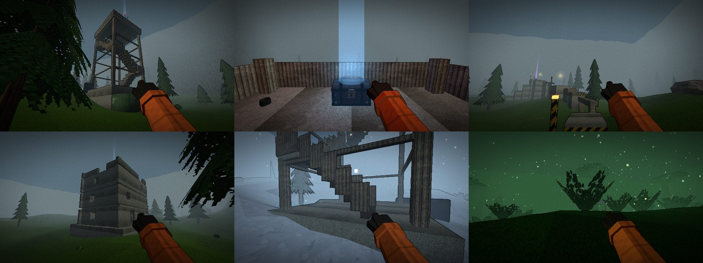

# WAVE 1 / worldx — open world that keeps growing

Owner brief: "açık dünya ve mapler sonsuza kadar büyüsün… buildingler, kuleler, parkur, chestler, ağaç kırma, lav gezegeni…"

Module name `worldx`, installed with `this.useModule('worldx', installWorldX)` (game.js slot) — everything else hangs off the
mod event bus (`mapLoaded`, `moonPopulated`, `interactables`, `update`, `netReady`, `tfg:pry`).
`game.worldx = { chests(), chest(id), openChest(id), harvest, hazards, landmarks(), dispose() }`.

## Files

| File | What |
|---|---|
| `src/world/landmarks.js` (new) | landmark planning + geometry: towers, ruins, parkour routes, billboard wrecks; chest / scrap spots |
| `src/models/chest.js` (new) | procedural chests (wood / iron / gold / void), lid hinge, tier glow beam |
| `src/game/chests.js` (new) | chest placement (landmarks + random outdoor + facility), hold-E opening, locks, host loot, sync |
| `src/game/harvest.js` (new) | tree chopping / rock mining (hold E or melee swing), fall animation, drops |
| `src/game/worldx.js` (new) | installer: wires the above + lava / ice hazards + death text + translations |
| `src/world/biomes_wave1.js`, `biomes_wave1_data.js` (new) | LAVA / ICE / JUNGLE biome definitions + decor builders |
| `src/world/terrain.js` (shared, owned) | lava rivers, frozen lakes, avoid() = lava/unreachable/landmarks, harvestable tree/rock registry |
| `src/world/outdoor_biomes.js` (shared, owned) | `registerDecor()` + `DECOR_HELPERS` exports (append-only) |
| `src/game/moongen.js` (shared, owned) | new planets in deeper sectors, new modifiers, growing map scale |
| `src/game/game.js` | ONLY the two placeholder lines (`[import:worldx]`, `[slot:worldx]`) |
| `tools/harness/wave1_worldx.js` (new) | headless proof script (see "How to test") |

No hooks were needed in `host.js` / `actions.js` / `facility.js` (all done through mod events + instance-level wrappers that are
undone in `dispose()`): `game.resolveMelee` (swing hits count as chops), `game.player.update` (ice friction), `game.deathText` (lava).

## 1. Landmarks (`src/world/landmarks.js`)

3-7 per outdoor moon (3 + 5 x (mapScale-1) + 1 on tier >= 3 + 1 on sector >= 3 + 0..1 + `moon.landmarkBonus`), always at least one tower,
one ruin and one parkour when they fit. Planned before trees / rocks / outposts (they avoid the footprints), never within the path
corridor (ship <-> facility), on lava, on unreachable land or near the ship / entrance / fire exits / ponds. Deterministic: only the
seeded RNG (`seed ^ 0x1a4d3a`, per-site streams), never `Math.random`; layout and colliders never depend on optional GLB models
(ext models are visual dressing only, colliders use fixed sizes).

* **Tower** (radio mast with blinking red beacon / watch cabin): 3-5 flights of 10 steps (0.3 m rise, autostep-friendly), corner
  landings with rails, deck + parapet, crown; chest on the deck. 9-15 m.
* **Ruin**: 11 x 9 m, 2-3 storeys + roof, walls with doors / windows (some sills at 0.8 m are vaultable) / collapsed sections, stair
  block (dogleg, headroom cut-outs), broken floor holes, door steps down to the terrain, rubble; roof chest (+ ground floor wood chest).
* **Parkour**: 9-14 platforms (pillars, pipes 0.85 m wide, floating debris slabs, crate stacks, rest platforms with lamps), ends on a
  4 m goal platform with a gold / void / iron chest; a set of 2.4 m ledges leads back down safely.
  Tuned to the real controller (jump 6.2 m/s, g 19.6 -> 0.98 m / 0.63 s; walk 5.0, sprint 8.2; fall damage above ~3.1 m): ordinary hops
  are <= 2.6 m edge gap and <= 0.7 m rise (walkable), ~28 % "hard" hops up to 3.7 m need a sprint run-up, rises are capped at 0.78 m,
  drops at 1.0 m per hop. `hopReach(dh, speed)` is exported; the harness re-checks every hop with the real physics.
* **Billboard wreck**: posts + a unique canvas ad screen (flickering), scaffold, sometimes a wood chest. Internet-theme set dressing.

Geometry is ONE merged mesh per level texture for the whole map (GeoBuilder with a frame transform), Rapier boxes for colliders.

## 2. Chests (`src/game/chests.js`, `src/models/chest.js`)

| Tier | Lock | Drops | Item tier range | Extras |
|---|---|---|---|---|
| wood | none | 2-3 | common..rare | no beam |
| iron | key / lockpick / melee pry / crowbar | 3-4 | uncommon..epic | blue beam + light |
| gold | same, harder minigame | 4-5 | rare..legendary | gold beam + light |
| void | same, hardest | 5-6 | epic..mythic | purple beam + light |

* Placement (deterministic, all peers): landmark chests (tower top, ruin roof / ground floor, parkour goal, billboard), 2-5 random outdoor chests
  (`seed ^ 0xc4e57`), facility chests (`facility.chestSpots` = `[{x,y,z,room,tier?}]` when the facility module provides them, otherwise 1-3
  dead-end scrap spots far from the entrance). Outposts' supply crates are untouched.
* Opening: hold E 1.5 s ("Open chest [hold E]", progress bar in the prompt). Locked chests: key (consumed), lockpick (lockpick minigame,
  charge used), melee weapon (loud pry minigame + noise), or the crowbar soft-event `game.mods.emit('tfg:pry', { pos: [x,y,z] })`
  (nearest locked chest within 3.4 m of `pos`, sender within 5 m). Host validates range, lock and held item.
* Host rolls loot with `game.crafting?.rollChestLoot?.(tier, rng)` -> `[{ type, tier }]`, else the fallback table (`fallbackChestLoot`, exported):
  scrap by value tier (max 2 per chest), components (`comp_*`), tools, weapons / bags / skillbooks (`skillbook_*`, `bag_*`) only when they exist in
  `ITEMS` at runtime. Items pop out with physics: `game.items.hostSpawn(type, pos, { tier, valueMul, linvel })`.
* State: `wxState` host->all `{ s: seed, id }` (+ `list` for late joiners via `wxSync`), added to `HOST_ONLY`. Reward XP + Clout to the opener.
* Keys: the host spawns `ceil(lockedChests / 2)` spare keys at landmark bases on `moonPopulated`, so locked chests are never dead ends;
  plus ~6 scrap items up on the landmarks (x1.3 value at the very top).
* Event for other modules: `tfg:chestOpened { id, tier, kind, pos, by, loot }`.

## 3. Trees and rocks (`src/game/harvest.js`)

`terrain.js` now tags every tree / rock collider (`{ kind: 'tree' | 'rock', hid }`) and returns `outdoor.harvest`. Hold E on one with a melee
weapon / tool (chop every 0.5 s) or just swing (LMB: `game.resolveMelee` is wrapped, the original still runs). Axes x3 on trees, pickaxes /
sledges / hammers x2.6 on rocks (anything melee x0.55). Host tracks HP (`50 + 30 x scale` tree, `90 + 50 x scale` rock), broadcasts `wxHp` /
`wxFell`; the tree falls away from the chopper (rotation animation, dust, shake), the instance is hidden, the collider removed. Drops:
`game.crafting?.dropComponents?.(pos, 'wood' | 'metal', n)` else `comp_wood` x2-5 / `comp_scrapmetal` x1-3 (+ 7 % `comp_crystal` from rocks).
Late joiners get the felled list (`wxHSync`).

## 4. New planets (`src/world/biomes_wave1*.js`, `terrain.js`)

| Biome | Display name | What is special |
|---|---|---|
| `lava` | Thermal Throttle Basin | glowing lava rivers carved into the terrain (never crossing the ship <-> facility path / fire-exit lines; unreachable land is left empty via a BFS), scorched glowing ground, obsidian shards, ember stones, smoke plumes, orange fog, sparks + embers, heat shimmer (engine warp) near the rivers. **Lava burns 60 dmg/s and kills after 1.2 s** (death text "took a bath in molten silicon."). |
| `ice` | Permafrost Cold Storage | snow, blue fog, flat **frozen lakes** (slippery: velocity blends back to the previous frame), ice spikes, snow drifts, 900-flake blizzard + **gusts** (fog swell + wind volume). |
| `jungle` | Link-Rot Jungle | giant trees with canopies + hanging vines, giant ferns, glowing mushrooms, humid green fog, drifting spores, ponds. |

They appear only in deeper sectors through `moongen.js`: sector >= 1 may swap 1-2 slots for ice / jungle, lava from sector >= 2 (never the soft
first server), using an own RNG stream (`hashString('wx1:' + key)`) so sectors 0-1 and every older roll stay identical. New modifiers:
`MELTDOWN` (lava rivers x1.5), `WHITEOUT` (permanent blizzard), `LINK BLOOM` (overgrowth + bots), `EXPEDITION SITE` (+2 landmarks).
`mapScaleFor(size, sector)`: +3 % map size per sector (cap 1.6x, terrain.js clamp) and bigger facilities; more landmarks deeper.



(Composite from the harness: tower exterior, chest on the tower top, parkour start, ruin, ice moon, jungle. The lava basin was screenshotted in an earlier run:
glowing river, embers, orange fog.)

## Measured (headless, `tools/harness/wave1_worldx.js`, software GL)

* `smoke_land.js` -> `errs: []` (hamsi factory, levrek mineshaft, palamut mansion). `npm run build` OK. Feature script: 0 page errors in every section.
* **Deterministic**: the same moon seed built three times gives identical landmark sites, chest / scrap spots and tree ids (`deterministic: true`).
* Landmarks per map: 3-4 on scale-1 moons (hamsi 4: tower + ruin + parkour + billboard), 5-6 on the 1.2x test planets; 214-414 collider boxes; 7-13 chests
  (tiers wood / iron / gold / void, e.g. hamsi 4 wood + 3 iron + 1 void, orkinos 5 wood + 3 iron + 3 gold).
* Chest loot: unlocked wood chest -> 3 items; locked iron chest refused without a tool, opened by the `tfg:pry` soft-event -> 4-5 items
  (scrap, components, tools, weapons). Fallback tables per tier (300 rolls): wood 2.5 items common..rare, iron 3.5 uncommon..epic,
  gold 4.5 rare..legendary, void 5.6 rare..mythic.
* Harvest: tree HP 84 -> 64 after a hit -> felled by the host, `comp_wood` x3 dropped; rock HP 133 -> felled, `comp_scrapmetal` x1.
* **Parkour** (real controller, aiming at the platform centre, 4-8.2 m/s): 9 / 9 hops landed on the target platform on the checked route
  (12 platforms, goal at +5.3 m). The pure check over 60 random routes x 644 hops found no hop beyond the jump physics.
* Lava: standing in a river killed the player after 1.2 s; 220 lava cells (6 m grid) on the test basin, 0 landmarks on lava, ship area dry.
  Ice: same launch speed slides 0.94 m on a frozen lake vs 0.15 m on dry ground. Jungle / ice / lava each load with 0 errors.
* Sectors (12 sectors, own RNG stream): ice / jungle / lava only from sector 1-2 on (lava from 2), old sectors identical, generation deterministic;
  map scale by sector index: sector 0 `[1, 1, 1, 1.22]`, 4 `[1.12, 1.25, 1.44]`, 9 `[1.44, 1.6, 1.6, 1.6]`.
* **Draw calls** (camera at the ship, default view; toggling the landmark mesh + chest models):
  hamsi 85 -> 101 (+16), palamut 86 -> 102 (+16), levrek 106 -> 114 (+8), orkinos 115 -> 139 (+24). Landmarks are 5 merged meshes for the whole map
  (concrete / metal / rust / hazard / glow) + 1-2 billboard screens; every chest cost 3 draws when this was measured, a closed chest is now one merged
  mesh (+ its beam), so expect roughly -1 per visible chest. Scale-1.2 planets: lava 138, ice 118, jungle ~300 (mostly the base game's bushes / ponds / props at
  that scale; the jungle decor itself is ~14 instanced meshes; the forced ponds were removed afterwards).

## How to test

```bash
node --check src/world/landmarks.js src/game/chests.js src/game/harvest.js src/game/worldx.js   # each file
npm run build
npx vite --host 127.0.0.1 --port 5190 --strictPort &
flock /tmp/tfg-browser.lock node tools/harness/headless.mjs --port 5190 --script tools/harness/smoke_land.js          # errs: []
flock /tmp/tfg-browser.lock node tools/harness/headless.mjs --port 5190 --script tools/harness/wave1_worldx.js > out.json  # JSON + shot (2x2 jpeg data URL)
```
In the console: `kefal.game.worldx.chests()`, `kefal.game.worldx.openChest('L0a')` (host), `kefal.game.worldx.harvest.nearest(kefal.game.player.pos)`.
To visit a new planet: `MOONS`-register `{ id, biome: 'lava' | 'ice' | 'jungle', ... }` (see the script) or route to a deep generated sector.

## Known issues / open

* Not hand-playtested with 2+ real players (host-authoritative messages are exercised locally only).
* Crowbar item (`tfg:pry`) belongs to another agent: the payload contract above is my guess (`{ pos }`, array / Vector3 / `{x,y,z}` all accepted).
* No ladder mechanic exists, so towers use stairs; the facility `chestSpots` contract is read softly (fallback picks dead-end scrap spots).
* Outdoor creatures do not path-find around landmarks (they can get stuck on ruins).
* Lava biome terrain is coarse (3.2 m grid): lava banks are a little blocky.
