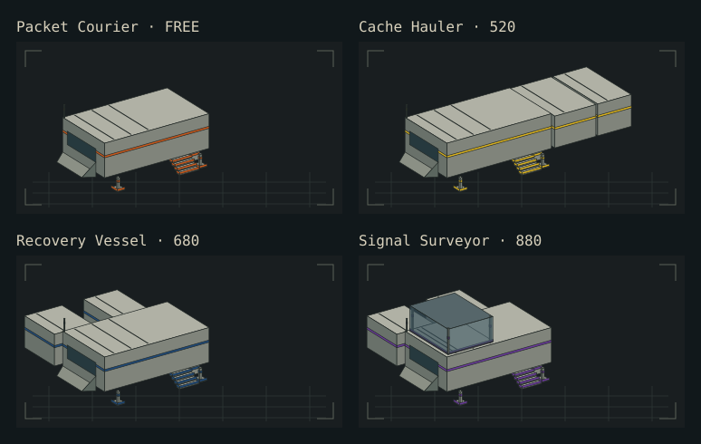

# Wave30 — visible fleet choices

The dock broker previously sold four vessels through names, prices and facts
without showing their shapes. The existing purchase cards now include faceted
exterior illustrations, so the player can compare the compact Courier, rear
freight Hauler, twin-wing Recovery Vessel and roof-canopy Surveyor while choosing.
The selected vessel has a warm border/background and an accessible selected state.



[Standalone SVG contact sheet](artifacts/fleet-previews.svg).
This is an offline illustration artifact, not a browser panel screenshot.

## Native layout and purchase flow

`src/game/fleet13_preview.js` projects the production core dimensions, shipyard
hardpoint room bounds and saved paint into static SVG faces. Native fitted rooms
determine the extensions; `fleet13` supplies `fleetQuote13(...).layout`, so an
owned vessel's modified layout/paint takes priority over the default brochure.
The ordinary four hulls share the same world scale. Larger saved extensions fit
within the image boundary instead of being cropped.

The warm ivory/charcoal/steel surfaces, small paint stripes, cockpit, faceted nose,
landing legs, airlock steps and Surveyor canopy follow the maintenance-crew art
direction. This is an authored exterior illustration derived from native bounds,
not a render of every installed furniture mesh or an additional world hull model.
The playable core and module geometry remain their existing implementation.

`src/game/fleet13.js` inserts each image into the existing card. Native purchase
buttons still perform the same host request and close the panel. Price, wallet,
owned upgrades, host authority, dock/range restrictions and crew dispatch remain
their original contracts. Inspection does not add a separate shop step.

The optional Dead Letter start keeps its proper mode name in the existing dock
goal and selected-vessel line: `Dead Letter Run · ...`. The native claim/boarding
instruction and actual distance remain the same single goal. Normal Campaign
has no prefix; there is no additional objective, popup or feature lock.

## Resource and UI ownership

No WebGL renderer, canvas, model instance, game material/texture, light, collider,
RAF, timer or preview event listener is created. SVG is ordinary panel DOM, with
no external image, animation or foreignObject. Closing/replacing the native panel
removes the image descendants; the preview introduces no close callback or shared
render owner. The browser still paints this DOM, so this is not a hardware FPS or
whole-session memory claim.

The production UI's original close/replacement and pointer-lock handoffs apply.
Preview text is escaped and geometry is deterministic. The native room set bounds
the illustration size, including owned extensions. Changing language and reopening
the broker resolves the existing vessel translations for image names/card labels.

## Focused evidence

```sh
source /workspace/.tfg-tools/activate.sh
npm test -- -j 2 fleet30 fleet13
node tools/art/fleet30.mjs
inkscape docs/wave30/artifacts/fleet-previews.svg --export-type=png --export-filename=docs/wave30/artifacts/fleet-previews.png
```

The focused suite passes 2/2. `fleet30` executes the actual Fleet open method,
native UI panel/button/close methods and native Fleet host callbacks with a DOM
boundary fixture. It verifies all four distinct image markups, owned layout/paint,
selected state, host/credit/dead/downed restrictions, optional mode context, native
close/replacement callback, repeated descendant detach and whole-crew dispatch.
The fixture rejects canvas creation. The existing `fleet13` test retains economy,
saved hull capabilities, cargo custody, migration and dock lifecycle coverage.

The contact sheet was inspected after offline SVG export. Neither the recording
DOM test nor that export establishes actual browser panel sizing, keyboard/gamepad
feel, representative device performance, cooperation or player enjoyment. The
owner's existing 5/10 experience baseline is unchanged by these checks.
